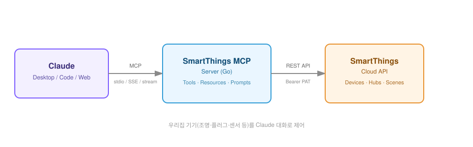

# Lango SmartThings MCP Server

[](https://smithery.ai/server/@langowarny/smartthings-mcp)

A **Model Context Protocol (MCP)** server that exposes Samsung **SmartThings Public API** as
LLM-friendly tools, resources and real-time events.



## Features

* **Lazy Loading**: Tools are discoverable without authentication - only validates API keys when tools are invoked
* Wraps common SmartThings operations as **MCP Tools**
  * **Devices**: `list_devices`, `get_device`, `get_device_status`, `list_device_capabilities`, `send_device_command`
  * **Locations & Rooms**: `list_locations`, `list_rooms`, `create_room`, `delete_room`
  * **Scenes & Rules**: `list_scenes`, `execute_scene`, `list_rules`
  * **Hubs**: `list_hubs`, `get_hub_health`
  * **Subscriptions**: `list_subscriptions`, `create_subscription`, `delete_subscription`
  * **Schedules**: `list_schedules`, `create_schedule`, `delete_schedule`
  * **History**: `get_device_history`
  * **Capabilities**: `get_capability`
* Exposes device / status / location data as **MCP Resources** with read-through cache
* Supports all official **MCP-Go transports**
  * **Stdio** (CLI / local), **StreamableHTTP**, **Server-Sent Events (SSE)**
* Periodic poller publishes live device status to SSE clients
* Zero external dependencies apart from `mcp-go` and `zap` logger

## Requirements

* Go ≥ 1.23
* A valid **SmartThings PAT** (Personal Access Token)

### Getting a Personal Access Token (PAT)

1. Go to [SmartThings Personal Access Tokens](https://account.smartthings.com/tokens).
2. Log in with your Samsung Account.
3. Click **Generate new token**.
4. Enter a name for your token and select the authorized scopes (e.g., `devices`, `locations`, `scenes`, `rules`, `schedules`).
5. Click **Generate token**.
6. **Copy and save** the token immediately (it won't be shown again).

## Environment Variables

| Name | Default | Description |
|------|---------|-------------|
| `smartThingsToken`, `SMARTTHINGS_TOKEN` | – | Bearer token for SmartThings API. **Required for SmartThings operations**, but server will start without it for tool discovery |
| `stBaseUrl`, `ST_BASE_URL` | `https://api.smartthings.com` | Override for testing / mock servers |
| `MCP_LOG_LEVEL` | `info` | `debug` | `info` | `warn` | `error` |

## Installation

### Installing via Smithery

To install smartthings-mcp for Claude Desktop automatically via [Smithery](https://smithery.ai/server/@langowarny/smartthings-mcp):

```bash
npx -y @smithery/cli install @langowarny/smartthings-mcp --client claude
```

### Manual Installation
```bash
git clone https://github.com/langowarny/smartthings-mcp.git
cd smartthings-mcp
go mod download
```

### Container Image (GHCR)

Every push to `main` (and every `vX.Y.Z` tag) is built by [`.github/workflows/docker-publish.yml`](.github/workflows/docker-publish.yml)
and published to the GitHub Container Registry as a multi-arch (`linux/amd64`, `linux/arm64`) image:

```
ghcr.io/electrohmi/smartthings-mcp:latest
```

Available tags: `latest` (tracks `main`), `vX.Y.Z` / `X.Y` (release tags), and `sha-<short-sha>` (every build).

```bash
docker pull ghcr.io/electrohmi/smartthings-mcp:latest
docker run -d --name smartthings-mcp \
  -p 8081:8081 \
  -e SMARTTHINGS_TOKEN=123ab456-xxx... \
  --restart unless-stopped \
  ghcr.io/electrohmi/smartthings-mcp:latest
```

### Synology NAS (Container Manager)

To run the server on a Synology NAS via **Container Manager** (DSM 7.2+), pulling the image built above:

1. **Container Manager → Registry**: search `ghcr.io/electrohmi/smartthings-mcp` and download the `latest` tag
   (or add `ghcr.io` as a custom registry under *Registry → Settings* if it isn't listed by default).
   If the GHCR package is private, log in first: *Registry → Settings → Add* with your GitHub username and a
   [PAT with `read:packages` scope](https://docs.github.com/en/packages/working-with-a-github-packages-registry/working-with-the-container-registry#authenticating-to-the-container-registry) as the password.
2. **Container Manager → Project**: create a new project, choose *Upload docker-compose.yml*, and upload the
   [`docker-compose.yml`](docker-compose.yml) from this repo (or paste its contents).
3. Set the `SMARTTHINGS_TOKEN` environment variable (Container Manager project *Environment* tab, or a `.env`
   file next to `docker-compose.yml` with `SMARTTHINGS_TOKEN=123ab456-xxx...`), then build/start the project.
4. The server listens on port `8081` (StreamableHTTP transport) — point your MCP client at
   `http://<synology-ip>:8081/mcp`.

Alternatively, from an SSH session on the NAS you can run the same `docker pull` / `docker run` commands shown
above, or `docker compose up -d` using the provided `docker-compose.yml`.

## Running

### Stdio

```bash
SMARTTHINGS_TOKEN=123ab456-xxx... go run ./cmd/server -transport stdio
```

### StreamableHTTP

```bash
SMARTTHINGS_TOKEN=123ab456-xxx... \
  go run ./cmd/server -transport stream -host 0.0.0.0 -port 8081
```

Test request:

```bash
curl -X POST http://localhost:8081/mcp/tools/call \
  -H 'Content-Type: application/json' \
  -d '{"jsonrpc":"2.0","id":1,"method":"tools/call","params":{"name":"list_devices"}}'
```

### SSE

```bash
SMARTTHINGS_TOKEN=123ab456-xxx... \
  go run ./cmd/server -transport sse -host 0.0.0.0 -port 8081

# Open event stream
echo -e 'GET /mcp/sse HTTP/1.1\nHost: localhost:8081\n\n' | nc localhost 8081
```

The server emits `smartthings/device_status` notifications every 30 seconds.

## Tool Catalogue

| Tool | Params | Description |
|------|--------|-------------|
| `list_devices` | `location_id?` | List user devices |
| `get_device` | `device_id` | Device metadata |
| `get_device_status` | `device_id` | Live status |
| `list_device_capabilities` | `device_id` | Supported capabilities |
| `send_device_command` | `device_id`, `component`, `capability`, `command`, `arguments?[]` | Issue command |
| `list_locations` | – | List locations |
| `list_rooms` | `location_id` | List rooms in a location |
| `create_room` | `location_id`, `name` | Create a new room |
| `delete_room` | `location_id`, `room_id` | Delete a room |
| `list_scenes` | – | List all scenes |
| `execute_scene` | `scene_id` | Trigger scene |
| `list_rules` | – | List automation rules |
| `list_hubs` | – | List hubs |
| `get_hub_health` | `hub_id` | Get hub health status |
| `list_subscriptions` | `installed_app_id` | List subscriptions |
| `create_subscription` | `installed_app_id`, `device_id`, ... | Subscribe to device events |
| `delete_subscription` | `installed_app_id`, `subscription_id` | Delete subscription |
| `list_schedules` | `installed_app_id` | List schedules |
| `create_schedule` | `installed_app_id`, `name`, `cron` | Create cron schedule |
| `delete_schedule` | `installed_app_id`, `schedule_id` | Delete schedule |
| `get_device_history` | `device_id` | Get recent device events |
| `get_capability` | `capability_id`, `version` | Get capability definition |

## Resource Patterns

| URI Template | Description | MIME |
|--------------|-------------|------|
| `st://devices/{device_id}` | Device metadata | `application/json` |
| `st://devices/{device_id}/status` | Live status | `application/json` |
| `st://locations/{location_id}` | Location metadata | `application/json` |

## Development

```bash
go vet ./...
go test ./...
go run ./cmd/server -transport stream
```

Logs are emitted via **Uber Zap**; adjust `MCP_LOG_LEVEL` for verbosity.

## License

MIT © 2025 Lango Warny
